# Adaptive Jenkins Agent

This plugin enables users to perform different administrative, maintenance, setup (pre-build), or cleanup (post-build) tasks on a specific agent each time a build is executed.

It functions differently from several similar plugins that typically allow users to define tasks
These plugin usually define these tasks as build-steps, therefore ties them only to a specific job. These tasks are then run everytime a build of this job is executed, regardless of the agent which executes it.

Adaptive Jenkins Agent plugin takes an opposite approach by allowing users to specify tasks to be run on a particular agent everytime it executes a build, regardless of what build is being executed.

To accomplish this, the plugin allows users to define various tasks that should be executed on the agent before, during, or after any build. Users can also set conditions for these tasks, ensuring that they are only performed on the agent if the specified conditions are met.

User can configure it in the node properties section of agent's configuration page:
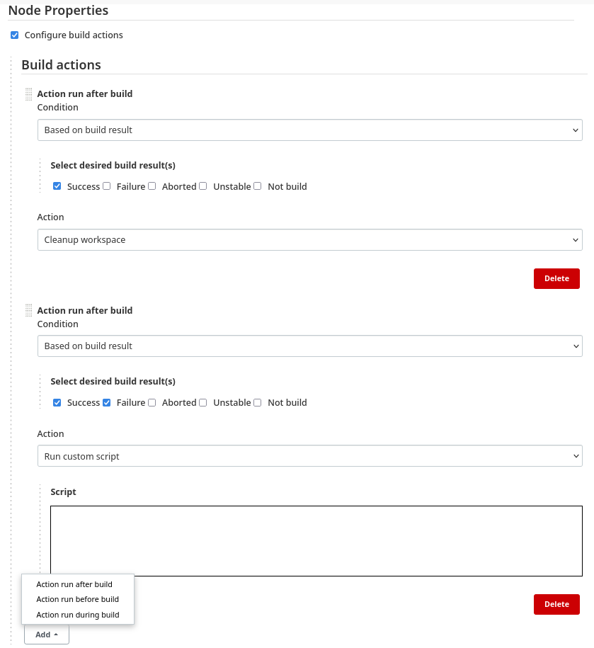

# Extension points

The plugin also defines extension points for defining additional conditions and tasks.

There are 3 extensions points for adding new tasks:
- PreBuildAction - task which can be selected to run before a build
- PostBuildAction - task which can be selected to run after a build
- DuringBuildAction - task which can be selected to run during a build

Classes implementing any task interface have to implement a method
runAction() which runs the logic of an task.

There are 3 extensions points for adding new conditions:
- PreBuildCondition - condition which can be selected for actions run before a build
- PostBuildCondition - condition which can be selected for actions run after a build
- DuringBuildCondition - condition which can be selected for actions run during a build

Classes implementing any condition interface have to implement
method conditionPasses() which returns a boolean whether the
condition passes.

# Phase

User can select 3 categories of tasks:
- Run after a build
- Run before a build
- Run during a build  - this requires user to specify a period in which it loops

Below is an example how to configure a task, whose condition is evaluated every 2 seconds, and stops once the condition evaluates (and task is executed)

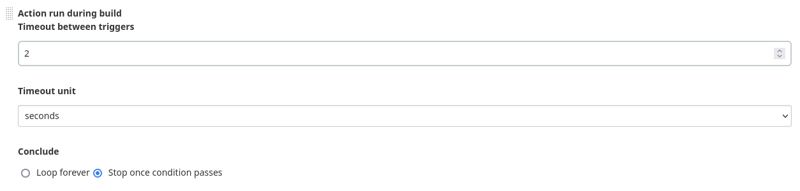
- 
# Tasks

This plugin also adds few basic tasks which user can select:
### Cleanup
Removes build's workspace

  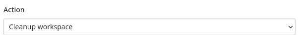
### Hard reboot
Reboots agent's system

  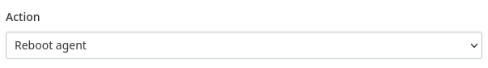
### Graceful reboot
Takes agent offline so no more new build are acceptedea nad waits for all the build running on the agent to finish before rebooting

  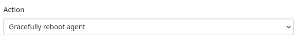
### Take agent offline

  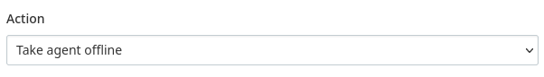
### Spawning groovy script

  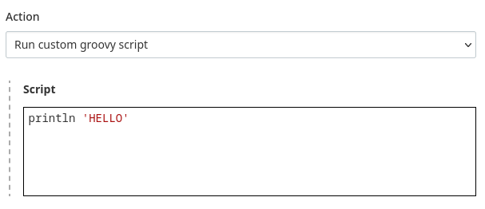
### Spawning shell script

  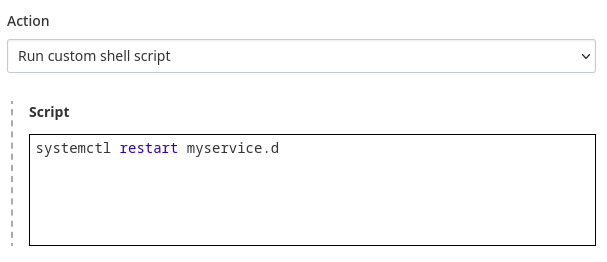
### Stop build

  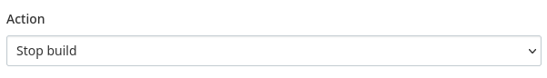

# Conditions

Conditions which can be combined with above-mentioned tasks. Tasks are only run of condition passes:
### Agent’s disk space 

Task is run only if available disk space or bigger/lesser than specified value

  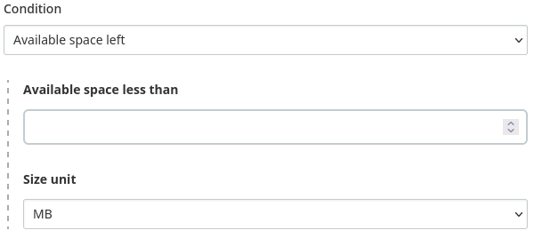
### Duration of the build

Task is run only if duration of a build is bigger/lesser than specified value

  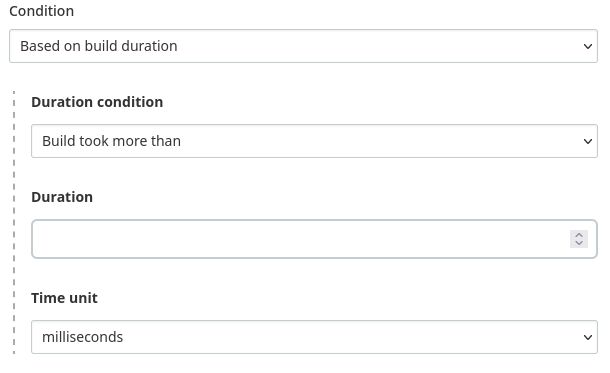
### Duration of previous builds

Task if average duration of N past builds is bigger/lesser than specified value

  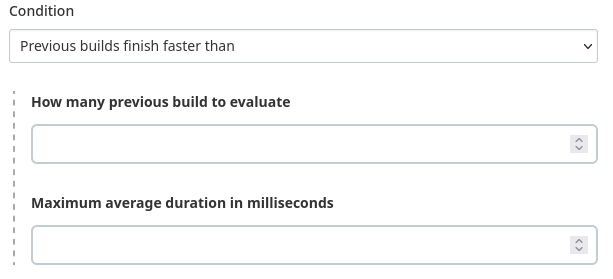
### Failing trend of previous builds

Task is run only N past builds have failed

  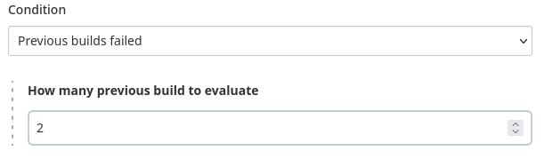
### No condition

Task is run everytime

  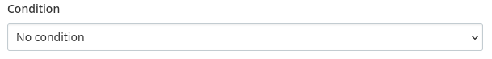
### Result of a build

Task is run of build executed by the agent has some specific result

  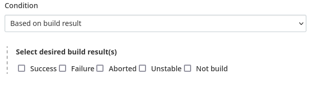
### Script

Task is run only if script returns zero value

  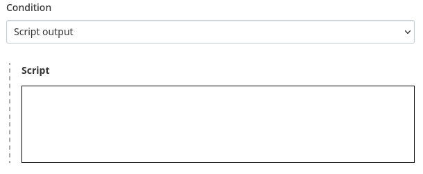
